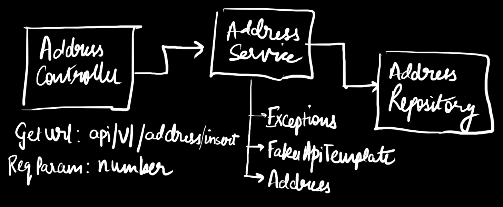
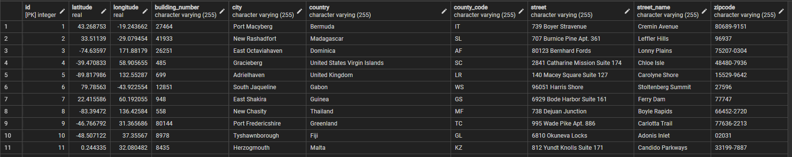

# Address Fetch Microservice

## Introduction
An API made in Spring Boot to fetch *n* number of address from FakerAPI and put it in a PostgreSQL database.


## API Endpoints
1. api/v1/address/insert?number=<number> - To fetch addresses from FakerAPI and insert in DB
2. api/v1/address/list - To list contents of the DB

## Database
Connection is made to a PostgreSQL database and the addresses received from the FakerAPI are being inserted in the table.


## Unit Tests
Tests are written using junit and mockito for the service function.

1. Test 1 <br>
 *Fetch address using FakerAPI and put the records in the database successfully.*
    ```
   Expected return statement-
   Status: 200
   Body: "Database updated successfully!"
   ```
2. Test 2 <br>
   *FakerAPI gives empty response even when number is set > 0.*
    ```
   Expected return statement-
   Status: 204
   Body: "FakerAPI gave no data in response"
   ```
3. Test 3 <br>
   *Get request to FakerAPI gives a HttpError.*
    ```
   Expected return statement-
   Status: 500
   Body: "FakerAPI response status Code was not 200"
   ```
4. Test 4 <br>
   *Any other error caused inside the service.*
    ```
   Expected return statement-
   Status: 500
   Body: "Error: " + error_message
   ```